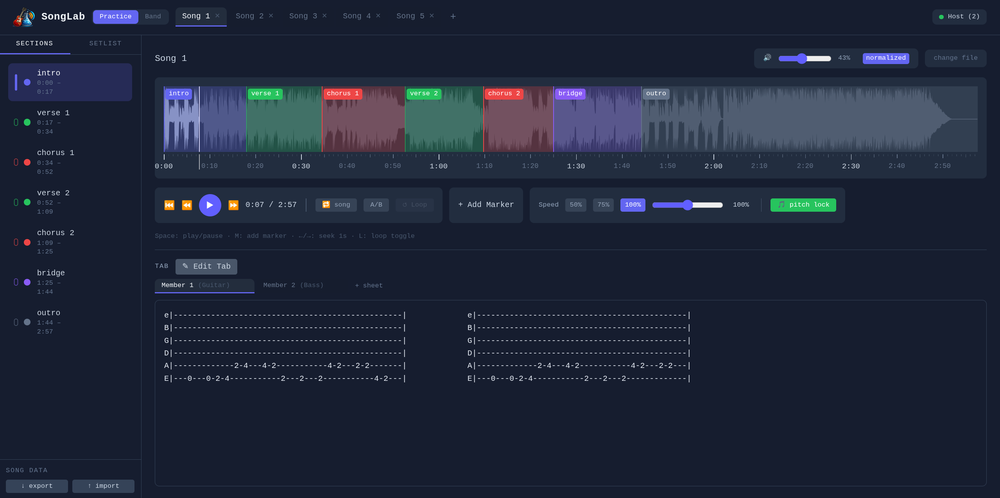
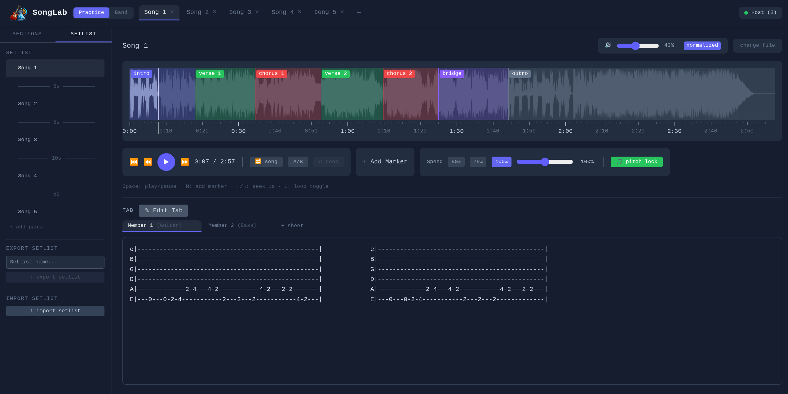
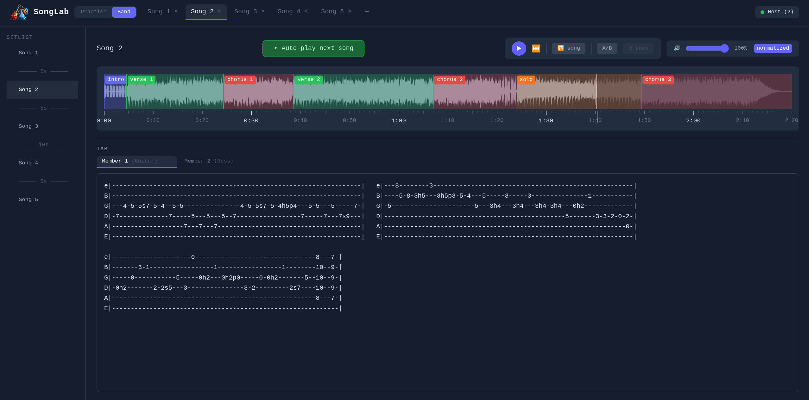
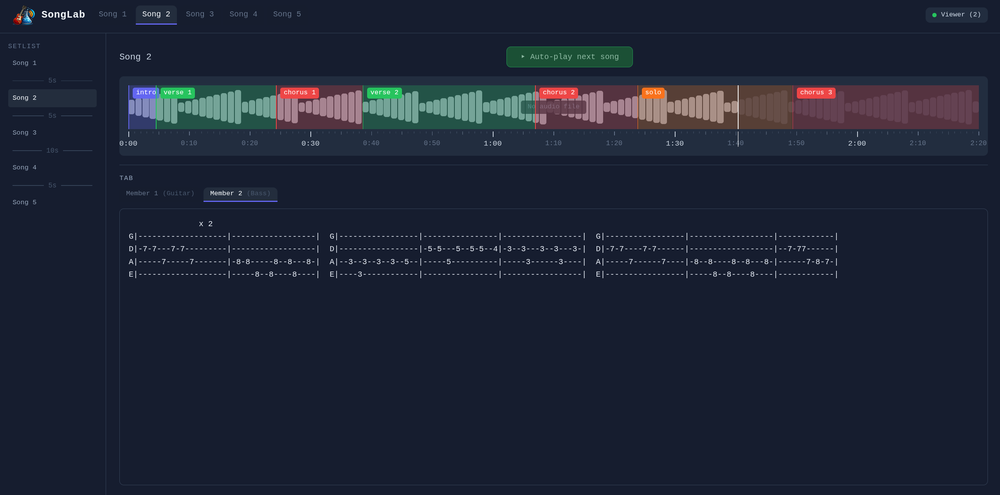

# SongLab

**Practice & song structure tool for your browser.**

**[Try it now](https://elbeh.github.io/songlab/)** – no install, runs entirely in your browser. Note: Only solo mode. Band Sync Mode is **not** available on GitHub Pages. If you want to use the Band Sync Mode you need to run a server on your local device.

[](https://creativecommons.org/licenses/by-nc-sa/4.0/)


---

## What is SongLab?

SongLab is a browser-based practice tool for musicians and bands (all major browsers supported). Load a song, visualize its waveform, mark sections (Chorus, Verse, Bridge, Solo…), attach ASCII tabs or notes per section, and practice at your own pace with looping and tempo controls. Band Sync Mode turns it into a shared digital music stand over your local network with your own setlist.

### Features

- **Waveform visualization** – Load MP3, WAV, OGG or FLAC files and see the full waveform
- **Section markers** – Color-coded markers for Intro, Verse, Chorus, Bridge, Solo and more
- **ASCII tab editor** – Multiple tab sheets per song (Guitar, Bass, Keys, Vocals, Drums) with auto-scroll during playback
- **Section & A/B looping** – Loop any section or custom range with a loop counter and target count
- **Tempo control** – Slow down to 50% or speed up to 150% with optional pitch correction
- **Song library** – Persistent storage via IndexedDB, songs survive browser restarts
- **Setlists** – Build ordered playlists with drag & drop reordering and pause entries
- **Dummy songs** – Create songs without audio for tab-only practice or pre-show prep
- **Band Sync Mode** – Real-time sync across devices on your local network (one host, multiple viewers)
- **PWA support** – Install as a standalone app, works offline after first load

## Screenshots
 
### Practice Mode – Sections & Markers
Color-coded section markers on the waveform, section list with timestamps, ASCII tab editor with multiple sheets, speed and pitch controls.
 

 
### Practice Mode – Setlist
Setlist sidebar with songs and pause entries, drag & drop reordering, setlist export/import.
 

 
### Band Sync – Host
Full playback control, auto-advance between songs, real-time sync to all connected viewers.
 

 
### Band Sync – Viewer
Read-only view on any device in the local network. Each member picks their own instrument sheet.
 


## Quick Start

### Prerequisites

- [Node.js](https://nodejs.org/) >= 18
- npm (comes with Node.js)

### Solo Practice (Development)

```bash
git clone https://github.com/ElBeh/songlab.git
cd songlab
npm install
npm run dev
```

Open `http://localhost:5173` in your browser.

### Band Sync Mode

Band Sync requires building the app and running the sync server. All band members connect to the host's IP address.

```bash
# Build the frontend
npm run build

# Start the sync server (serves the app + WebSocket)
npm start
```

The server starts on `http://0.0.0.0:3000`. Band members open `http://<host-ip>:3000` on their devices.

**During development** you can run both Vite and the sync server simultaneously:

```bash
npm run dev:sync
```

### How Band Sync Works

SongLab's Band Sync is designed for the **shared room** scenario: the band plays live, the app provides a synchronized digital music stand on every device.

- **Host** controls playback, song selection, and setlist navigation
- **Viewers** see the current song, section markers, and their chosen tab sheet in real time
- **No audio streaming** – the sync server only transmits playback position, markers, and tab content
- Viewers are **read-only** – only the host can edit sections, tabs, and control playback

## Tech Stack

| Category | Technology |
|---|---|
| Language | TypeScript 5.9 |
| Framework | React 19 |
| Bundler | Vite 7 |
| Audio | wavesurfer.js 7 |
| State management | Zustand |
| Persistence | IndexedDB (via idb) |
| Styling | Tailwind CSS 4 |
| Band Sync | Express 5 + socket.io 4 |
| PWA | vite-plugin-pwa |

## Roadmap

- Count-in with audio click before song playback (configurable beats & BPM)
- Metronome for dummy songs (audio click during playback)
- Band Sync: mDNS auto-discovery (no more manual IP entry)
- Tauri desktop app with bundled sync server
- Band Sync enhancements: host promotion, presenter mode

## License

This project is licensed under [CC BY-NC-SA 4.0](https://creativecommons.org/licenses/by-nc-sa/4.0/).