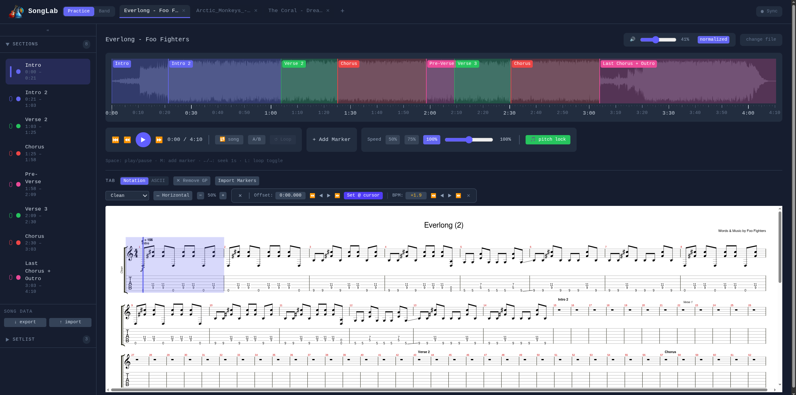
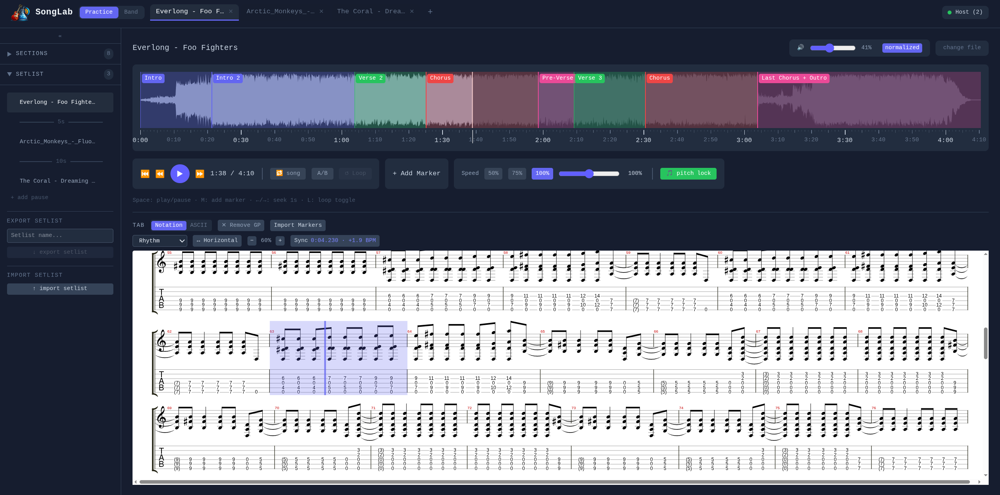
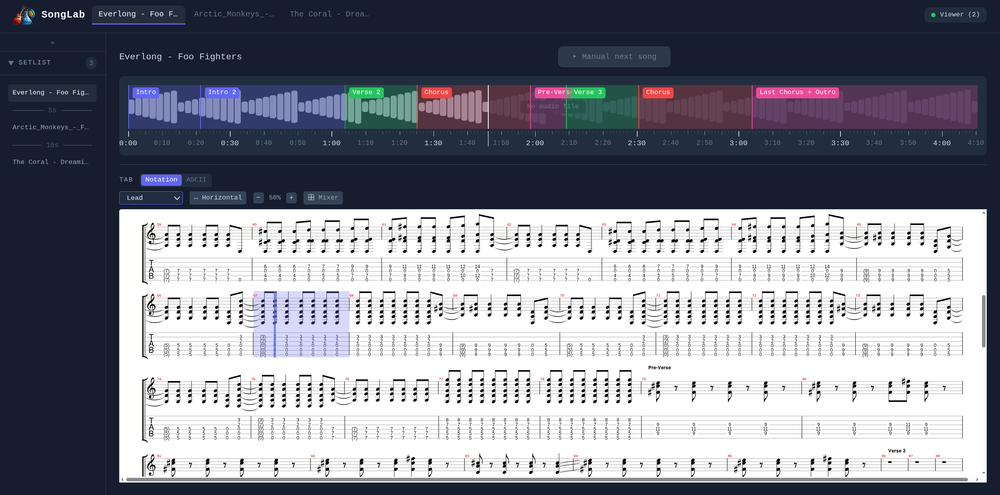
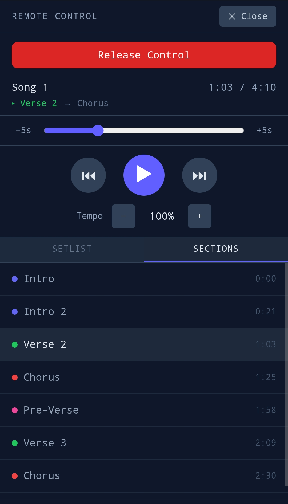
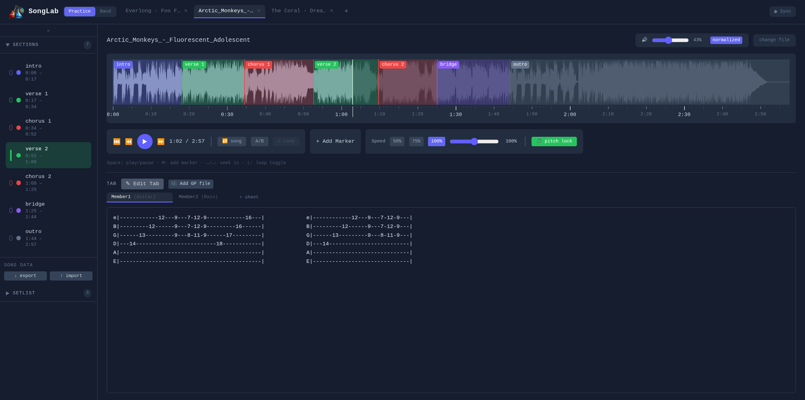
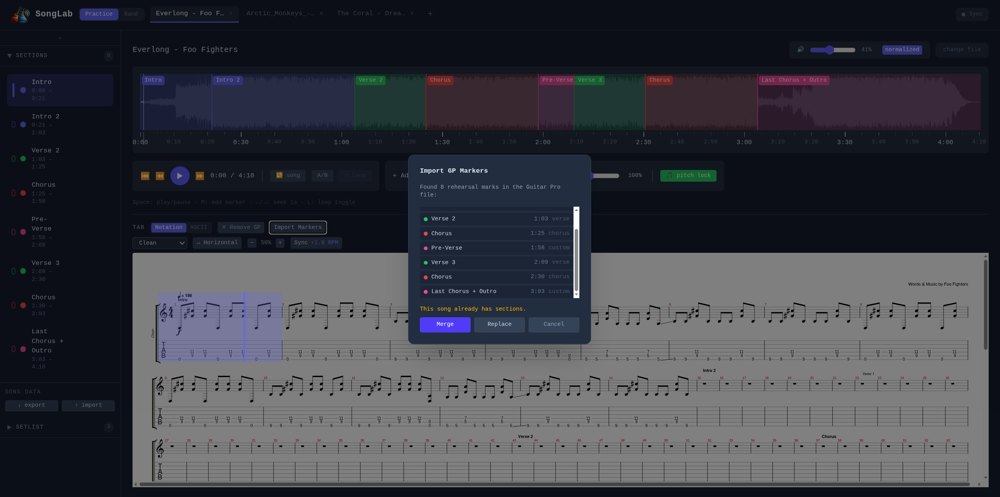
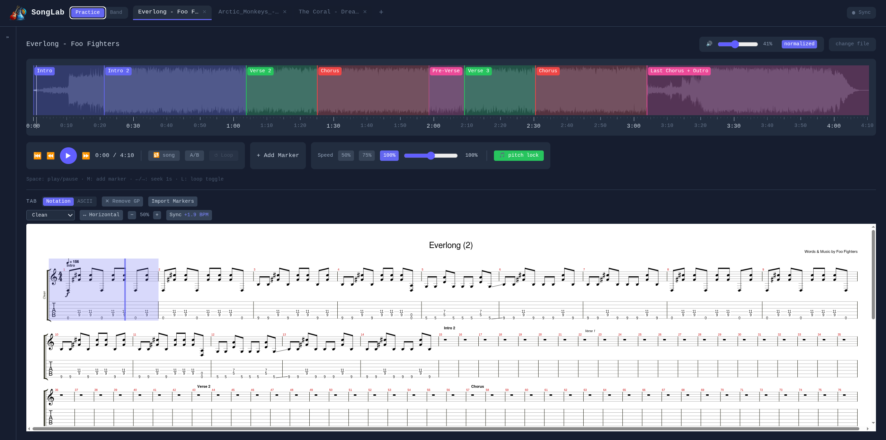

# SongLab

**Practice tool & digital music stand for guitarists and bands.**

**[Try it now](https://elbeh.github.io/songlab/)** – no install, runs entirely in your browser.
Solo practice only; Band Sync requires a [local server](#band-sync-mode).

[](https://creativecommons.org/licenses/by-nc-sa/4.0/)


<!-- TODO: Record hero GIF — load song, press play, notation cursor follows waveform, click section marker to jump (10–15s, ~800px wide) -->


---

## What is SongLab?

SongLab is a browser-based practice tool for musicians and bands. Load a song, visualize its waveform, mark sections (Chorus, Verse, Bridge, Solo…), and practice at your own pace with looping and tempo controls.

Attach a **Guitar Pro file** (.gp3–.gp8, .gpx) to any song and SongLab renders professional notation and tablature via [alphaTab](https://alphatab.net/), synchronized to your audio. No Guitar Pro file? Use the built-in ASCII tab editor instead — or both side by side.

**Band Sync Mode** turns SongLab into a shared digital music stand over your local network: one host controls playback while every band member follows along on their own device with their own instrument track.

Everything stays on your device — songs, files, and settings are stored locally (IndexedDB), no cloud, no account. Installable as a PWA, fully offline-capable after first load.

---

## Highlights

- **Waveform playback** with section markers, drag-to-reposition, and color coding
- **Guitar Pro notation** synchronized to your audio, with track selector and mixer — or MIDI playback straight from the GP file when no audio is loaded
- **Looping**: one-click section loops, custom A/B loops with draggable handles, loop counter with target
- **Tempo control** (50%–150%) with pitch correction, plus count-in and BPM-synced metronome
- **ASCII tab editor** with multiple sheets per song (Guitar, Bass, Keys, Vocals, Drums) and playback auto-scroll
- **Song library & setlists** with drag & drop ordering, pause entries, and JSON export/import
- **Band Sync**: real-time sync across devices — host controls, viewers follow with their own track, smartphones act as remote controllers
- **MIDI footswitch support** with MIDI Learn for hands-free control while playing

<details>
<summary><strong>Full feature list</strong></summary>

### Audio & Waveform
- Load MP3, WAV, OGG, or FLAC files with full waveform visualization
- Playback speed control (50%–150%) with optional pitch correction
- Volume control with RMS-based audio normalization
- Persistent audio storage — songs survive browser restarts (IndexedDB)

### Guitar Pro Notation
- Render .gp3–.gp8 and .gpx files with professional notation and tablature (via alphaTab)
- Track selector for Guitar, Bass, Keys, Drums, and more
- Track mixer with per-track volume, mute, solo, and master volume
- Page layout (vertical scroll) and horizontal scroll modes with zoom control
- User-resizable notation panel height, remembered per layout mode
- **Audio + GP**: notation cursor synchronized to audio via BPM-based offset system
- **Dummy + GP**: alphaSynth plays MIDI from the GP file when no audio is loaded
- Sync Offset Editor for fine-tuning audio↔notation alignment (offset + BPM correction)
- Import rehearsal marks from GP files as section markers (Replace/Merge/Cancel)
- Tuning display — shows the active track's tuning (Drop D, DADGAD, etc.)

### Sections & Tabs
- Color-coded section markers (Intro, Verse, Chorus, Bridge, Solo, and more)
- Drag markers on the waveform to reposition
- ASCII tab editor with multiple sheets per section (Guitar, Bass, Keys, Vocals, Drums)
- Auto-scroll tabs during playback, synced to section timing
- Toggle between Notation Mode and ASCII Mode per song
- Import/export tabs as plain text

### Looping
- Loop any section with one click
- Custom A/B loop with draggable handles on the waveform
- Loop counter with configurable target count (e.g. "loop 10×") and auto-stop
- Song loop (repeat entire song)

### Count-in & Metronome
- Configurable click count-in (1 bar at song BPM) before playback and loop restarts, with visual countdown overlay
- Continuous metronome synced to song BPM, with solo mode, volume control, and real-time GP tempo tracking

### Song Library & Setlists
- Persistent song library with audio and GP files stored in IndexedDB
- Setlist builder with drag & drop reordering, numbering, and pause entries between songs
- Cross-setlist song search, copy/move songs between setlists
- Dummy songs (no audio) for tab-only practice or pre-show prep
- Song, setlist, and full-gig export/import (JSON), plus setlist import from cloud URLs (Dropbox, Google Drive)

### Band Sync
- Real-time sync across devices on your local network (WebSocket via socket.io)
- Host controls playback, song selection, and setlist navigation
- Viewers see notation cursor, section markers, and their chosen instrument track
- Remote Controller: control the host's transport and browse all setlists from a smartphone
- Auto-advance to next song with configurable countdown
- GP files and all song data transferred to viewers automatically
- No audio streaming — designed for live rehearsal in a shared room

### MIDI Input
- Connect USB MIDI footswitches and controllers via Web MIDI API (Chromium-based browsers)
- Configurable command mapping: play/pause, section/song navigation, loop toggle, tempo control
- MIDI Learn — assign any MIDI button to any command with one click
- Mappings persist across sessions

### UI & Workflow
- Accordion sidebar with collapsible Sections and Setlist panels; collapses fully for maximum practice space
- Keyboard shortcuts: Space (play/pause), M (add marker), ←/→ (seek), L (loop toggle)
- PWA support — install as standalone app, works offline after first load

</details>

---

## Screenshots & Demos

### Practice Mode – Notation
Guitar Pro notation rendered with alphaTab, synchronized to the audio waveform. Track selector, zoom control, and collapsible sync offset editor.



### Looping
<!-- TODO: Record loop GIF — drag A/B handles on the waveform, loop counter counts up (~8s) -->


### Band Sync – Host & Viewer
One host, any number of viewers on the local network. Each member picks their own instrument track; the notation cursor follows the host's playback position.

|  |  |
|:---:|:---:|
| **Host** | **Viewer** |

<details>
<summary><strong>More screenshots</strong></summary>

### Smartphone Remote Controller
Control the host from your smartphone: pick a song or section and take over transport control.

<p align="center">
  
</p>

### Practice Mode – ASCII Tabs & Sections
Color-coded section markers on the waveform, section list with timestamps, ASCII tab editor with multiple sheets per song.



### GP Marker Import
Import rehearsal marks from Guitar Pro files as section markers. Supports Replace, Merge, or Cancel when sections already exist.



### Sidebar – Accordion Layout
Sections and Setlist as independently collapsible accordion panels. The entire sidebar collapses to a narrow strip for more space during practice.



</details>

---

## Getting Started

### Just practice

Use the hosted version: **[elbeh.github.io/songlab](https://elbeh.github.io/songlab/)** — nothing to install. Optionally install it as an app (PWA) via your browser's install prompt; it works offline after the first load.

### Run locally (solo or Band Sync)

Running SongLab yourself requires [Node.js](https://nodejs.org/) >= 18 (npm included).

```bash
git clone https://github.com/ElBeh/songlab.git
cd songlab
npm install
npm run build
npm start
```

The server starts on `http://0.0.0.0:3000` — open `http://localhost:3000` in your browser. For **Band Sync**, band members on the same network open `http://<host-ip>:3000` on their devices.

### Development

For working on the code, `npm run dev` starts the Vite dev server on `http://localhost:5173`, and `npm run dev:sync` runs Vite and the sync server simultaneously.

### Browser Support

Chromium-based browsers (Chrome, Brave, Edge) and Firefox. MIDI input requires a Chromium-based browser (Web MIDI API).

---

## Band Sync Mode

Band Sync is designed for the **shared room** scenario: the band plays live, the app provides a synchronized digital music stand on every device. The sync server only transmits playback position, markers, and tab/notation content — no audio streaming.

- **Host** controls playback, song selection, and setlist navigation
- **Viewers** are read-only and follow along with their chosen track or tab sheet
- **Controllers** (e.g. a smartphone) can request transport control from the host

See [Run locally](#run-locally-solo-or-band-sync) for the server setup.

---

## Tech Stack

| Category | Technology |
|---|---|
| Language | [TypeScript](https://www.typescriptlang.org/) 5.9 |
| Framework | [React](https://react.dev/) 19 |
| Bundler | [Vite](https://vite.dev/) 7 |
| Audio | [wavesurfer.js](https://wavesurfer.xyz/) 7 |
| Notation | [alphaTab](https://alphatab.net/) 1.8 (MPL-2.0) |
| State Management | [Zustand](https://zustand.docs.pmnd.rs/) |
| Persistence | IndexedDB (via [idb](https://github.com/jakearchibald/idb)) |
| Styling | [Tailwind CSS](https://tailwindcss.com/) 4 |
| Band Sync | [Express](https://expressjs.com/) 5 + [socket.io](https://socket.io/) 4 |
| PWA | [vite-plugin-pwa](https://vite-pwa-org.netlify.app/) |

---

## Roadmap

- **Multi-track notation** — render several instrument tracks at once
- **Fretboard editor / chord lookup** — interactive fretboard for chord voicings and identification
- **Band Sync enhancements** — mDNS auto-discovery, host promotion, presenter mode
- **ESP32 footpedal** — dedicated WiFi/BLE hardware controller
- **Tauri desktop app** — native installer with bundled sync server (no terminal required)

---

## License

This project is licensed under [CC BY-NC-SA 4.0](https://creativecommons.org/licenses/by-nc-sa/4.0/).