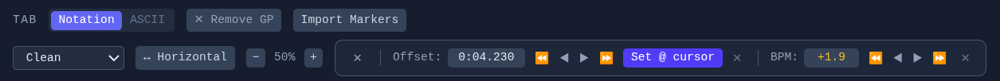

# SongLab

**Practice tool & digital music stand for guitarists and bands.**

**[Try it now](https://elbeh.github.io/songlab/)** – no install, runs entirely in your browser.
Solo practice only; Band Sync requires a [local server](#band-sync-mode).

[](https://creativecommons.org/licenses/by-nc-sa/4.0/)


---

## What is SongLab?

SongLab is a browser-based practice tool for musicians and bands. Load a song, visualize its waveform, mark sections (Chorus, Verse, Bridge, Solo…), and practice at your own pace with looping and tempo controls.

Attach a **Guitar Pro file** (.gp3–.gp8, .gpx) to any song and SongLab renders professional notation and tablature via [alphaTab](https://alphatab.net/), synchronized to your audio. No Guitar Pro file? Use the built-in ASCII tab editor instead — or both side by side.

**Band Sync Mode** turns SongLab into a shared digital music stand over your local network: one host controls playback while every band member follows along on their own device with their own instrument track.

---

## Screenshots

### Practice Mode – Notation
Guitar Pro notation rendered with alphaTab, synchronized to the audio waveform. Track selector, zoom control, and collapsible sync offset editor.

<!-- TODO: Replace with actual screenshot -->


### Band Sync – Host
Full playback control with notation, auto-advance between songs, real-time sync to all connected viewers.

<!-- TODO: Replace with actual screenshot -->


### Band Sync – Viewer
Read-only view on any device in the local network. Each member picks their own instrument track. Notation cursor follows the host's playback position.

<!-- TODO: Replace with actual screenshot -->


<details>
<summary><strong>More screenshots</strong></summary>

### Practice Mode – ASCII Tabs & Sections
Color-coded section markers on the waveform, section list with timestamps, ASCII tab editor with multiple sheets per song.

<!-- TODO: Replace with actual screenshot -->


### GP Marker Import
Import rehearsal marks from Guitar Pro files as section markers. Supports Replace, Merge, or Cancel when sections already exist.

<!-- TODO: Replace with actual screenshot -->


### Sidebar – Accordion Layout
Sections and Setlist as independently collapsible accordion panels. Entire sidebar collapses to a narrow strip for more space during practice.

<!-- TODO: Replace with actual screenshot -->


### Sync Offset Editor
Fine-tune audio-to-notation synchronization with offset nudge (±10ms/±100ms) and BPM correction (±0.1/±1.0).

<!-- TODO: Replace with actual screenshot -->


</details>

---

## Features

### Audio & Waveform
- Load MP3, WAV, OGG, or FLAC files with full waveform visualization
- Playback speed control (50%–150%) with optional pitch correction
- Volume control with RMS-based audio normalization
- Persistent audio storage — songs survive browser restarts (IndexedDB)

### Guitar Pro Notation
- Render .gp3–.gp8 and .gpx files with professional notation and tablature (via alphaTab)
- Track selector for Guitar, Bass, Keys, Drums, and more
- Track mixer with per-track volume, mute, and solo
- Page layout (vertical scroll) and horizontal scroll modes with zoom control
- **Audio + GP**: notation cursor synchronized to audio via BPM-based offset system
- **Dummy + GP**: alphaSynth plays MIDI from the GP file when no audio is loaded
- Sync Offset Editor for fine-tuning audio↔notation alignment (offset + BPM correction)
- Import rehearsal marks from GP files as section markers (with Replace/Merge/Cancel)

### Sections & Tabs
- Color-coded section markers (Intro, Verse, Chorus, Bridge, Solo, and more)
- Drag markers on the waveform to reposition
- ASCII tab editor with multiple sheets per section (Guitar, Bass, Keys, Vocals, Drums)
- Auto-scroll tabs during playback, synced to section timing
- Toggle between Notation Mode and ASCII Mode per song
- Import/export tabs as plain text

### Looping
- Loop any section with one click
- Custom A/B loop with draggable handles on the waveform
- Loop counter with configurable target count (e.g. "loop 10×")
- Auto-stop when target is reached
- Song loop (repeat entire song)

### Song Library & Setlists
- Persistent song library with audio stored in IndexedDB
- Setlist builder with drag & drop reordering and pause entries between songs
- Dummy songs (no audio) for tab-only practice or pre-show prep
- Song and setlist export/import (JSON)

### Band Sync Mode
- Real-time sync across devices on your local network (WebSocket via socket.io)
- Host controls playback, song selection, and setlist navigation
- Viewers see notation cursor, section markers, and their chosen instrument track
- Auto-advance to next song with configurable countdown
- GP files and all song data transferred to viewers automatically
- No audio streaming — designed for live rehearsal in a shared room

### UI & Workflow
- Accordion sidebar with collapsible Sections and Setlist panels
- Collapsible sidebar for maximum practice space
- Keyboard shortcuts: Space (play/pause), M (add marker), ←/→ (seek), L (loop toggle)
- PWA support — install as standalone app, works offline after first load

---

## Quick Start

### Prerequisites

- [Node.js](https://nodejs.org/) >= 18
- npm (comes with Node.js)

### Solo Practice (Development)

```bash
git clone https://github.com/ElBeh/songlab.git
cd songlab
npm install
npm run dev
```

Open `http://localhost:5173` in your browser.

### Band Sync Mode

Band Sync requires building the app and running the sync server. All band members connect to the host's IP address.

```bash
# Build the frontend
npm run build

# Start the sync server (serves the app + WebSocket)
npm start
```

The server starts on `http://0.0.0.0:3000`. Band members open `http://<host-ip>:3000` on their devices.

**During development** you can run both Vite and the sync server simultaneously:

```bash
npm run dev:sync
```

### How Band Sync Works

SongLab's Band Sync is designed for the **shared room** scenario: the band plays live, the app provides a synchronized digital music stand on every device.

- **Host** controls playback, song selection, and setlist navigation
- **Viewers** see the current song, section markers, and their chosen tab sheet or notation track in real time
- **No audio streaming** – the sync server only transmits playback position, markers, and tab/notation content
- Viewers are **read-only** – only the host can edit sections, tabs, and control playback

---

## Tech Stack

| Category | Technology |
|---|---|
| Language | [TypeScript](https://www.typescriptlang.org/) 5.9 |
| Framework | [React](https://react.dev/) 19 |
| Bundler | [Vite](https://vite.dev/) 7 |
| Audio | [wavesurfer.js](https://wavesurfer.xyz/) 7 |
| Notation | [alphaTab](https://alphatab.net/) 1.8 (MPL-2.0) |
| State Management | [Zustand](https://zustand.docs.pmnd.rs/) |
| Persistence | IndexedDB (via [idb](https://github.com/jakearchibald/idb)) |
| Styling | [Tailwind CSS](https://tailwindcss.com/) 4 |
| Band Sync | [Express](https://expressjs.com/) 5 + [socket.io](https://socket.io/) 4 |
| PWA | [vite-plugin-pwa](https://vite-pwa-org.netlify.app/) |

---

## Roadmap

- **Tuning display** — show the active track's tuning from the Guitar Pro file (Drop D, DADGAD, etc.)
- **Count-in** — configurable audio click before song playback starts (BPM-based)
- **Metronome** — continuous click during playback for dummy songs
- **Fretboard editor / chord lookup** — interactive fretboard for chord voicings and identification
- **Band Sync enhancements** — mDNS auto-discovery, host promotion, presenter mode
- **Tauri desktop app** — native installer with bundled sync server (no terminal required)

---

## License

This project is licensed under [CC BY-NC-SA 4.0](https://creativecommons.org/licenses/by-nc-sa/4.0/).